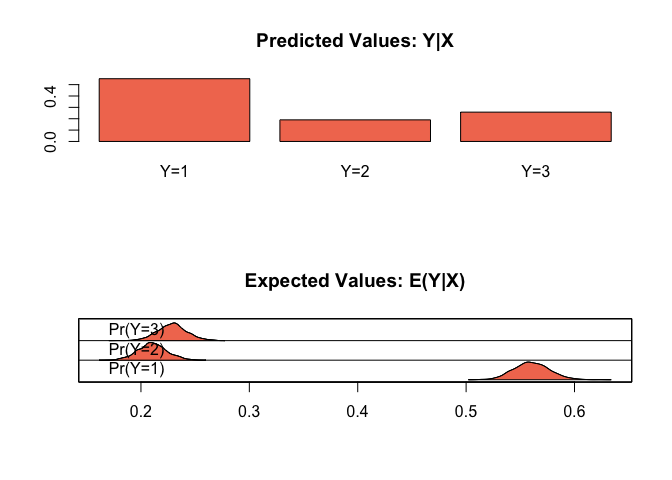

<!-- README.md is generated from README.Rmd. Please edit that file -->
ZeligChoice
===========

<a href="http://zeligproject.org"></a>

[](http://cran.r-project.org/package=ZeligChoice) [](https://travis-ci.org/IQSS/ZeligChoice) [](https://codecov.io/gh/IQSS/ZeligChoice) [](https://gitter.im/Zelig-dev/Lobby?utm_source=share-link&utm_medium=link&utm_campaign=share-link) [Dev-Blog](https://medium.com/zelig-dev)

**ZeligChoice** is a module with additional models for the [Zelig](https://github.com/IQSS/Zelig) statistical package in R.

Project page and publications available at: <http://zeligproject.org>


Use
---

**ZeligChoice** follows the same workflow as core [Zelig](https://github.com/IQSS/Zelig#zelig-5-workflow-overview).

Here us a simple example using the Zelig 4 wrappers (you can also use Zelig 5 reference classes). Note: installing and loading the **zeligverse** package will install and load all of the packages you need to use **ZeligChoice**.

``` r
# Load required packages
library(zeligverse)

# Load example data
data(mexico)

# Extimate model
z.out <- zelig(as.factor(vote88) ~ pristr + othcok + othsocok,
               model = "mlogit", data = mexico, cite = FALSE)

# Set fitted values
x.out <- setx(z.out)

# Simulate quantities of interest
s.out <- sim(z.out, x.out)

# Plot results
plot(s.out)
```



Installation
------------

You can install ZeligChoice from CRAN or, the developerment version from GitHub with:

``` r
# install.packages("devtools")
devtools::install_github("IQSS/ZeligChoice")
```
